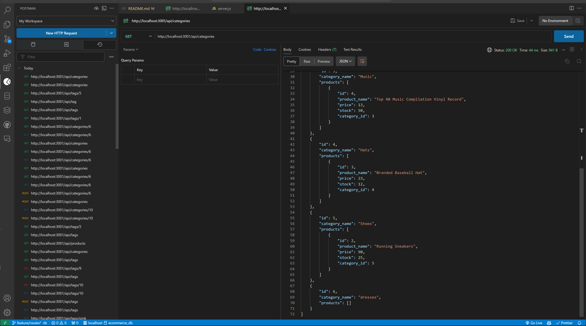

# E-commerce Back End

## Description

I was given the task of building the back end for an e-commerce web site. E-commerce (internet retail) plays a significant role in all industries, but especially in electronics. E-commerce platforms provide a variety of services to businesses of all sizes. Due to the widespread usage of these platforms, it is important for web developers to understand the architecture of e-commerce sites. During the making of this project, I was required to take a working Express.js API and configure it to use Sequelize to interact with a MySQL database. Once it is up and running I will be able to display data from categories, products, and tags in a formatted JSON. The application should also be able to create, update, and delete data in the MySQL database.

## Table of Contents

- [Description](#description)
- [Usage](#usage)
- [Credits](#credits)
- [Contact Info](#contact-info)
- [License](#license)

## Usage

First, you will need to install Node.js and install the packages to connect your Express.js API to a MySQL database. Be sure to install the dotenv package to store your user name and password. Make sure you log into MySQL, then run the schema.sql file to create the database using MySQL shell commands. Then use the "npm run seed" command to seed the database. Once the database is seeded, run the server and then head on over to Postman or Insomnia to test routes for categories, products, and tags.
https://github.com/jaschmidt22/Jessicas-e-commerce-back-end
https://drive.google.com/file/d/1tE2b5bu4GPwDQQ90tDfqtsU0z3DSEoNR/view

## Credits

Throughout the making of this project, I frequently referenced my class repository ASU-VIRT-FSF-PT-10-2023-U-LOLC. I also referenced Google, W3Schools, MDN Webdocs, dev.mysql.com, sequelize.com, npmjs.com/express, npmjs.com/dotenv, Postman, and chatGPT. I also received tips during a tutoring session with Michell Brito. 

## Contact Info

jessicaschmidt22@yahoo.com

## License

Copyright (c) [2024] [jaschmidt22]

Permission is hereby granted, free of charge, to any person obtaining a copy of this software and associated documentation files (the "Software"), to deal in the Software without restriction, including without limitation the rights to use, copy, modify, merge, publish, distribute, sublicense, and/or sell copies of the Software, and to permit persons to whom the Software is furnished to do so, subject to the following conditions:

The above copyright notice and this permission notice shall be included in all copies or substantial portions of the Software.

THE SOFTWARE IS PROVIDED "AS IS", WITHOUT WARRANTY OF ANY KIND, EXPRESS OR IMPLIED, INCLUDING BUT NOT LIMITED TO THE WARRANTIES OF MERCHANTABILITY, FITNESS FOR A PARTICULAR PURPOSE AND NONINFRINGEMENT. IN NO EVENT SHALL THE AUTHORS OR COPYRIGHT HOLDERS BE LIABLE FOR ANY CLAIM, DAMAGES OR OTHER LIABILITY, WHETHER IN AN ACTION OF CONTRACT, TORT OR OTHERWISE, ARISING FROM, OUT OF OR IN CONNECTION WITH THE SOFTWARE OR THE USE OR OTHER DEALINGS IN THE SOFTWARE. Copy license text to clipboard Suggest this license Make a pull request to suggest this license for a project that is not licensed. Please be polite: see if a license has already been suggested, try to suggest a license fitting for the project’s community, and keep your communication with project maintainers friendly.
